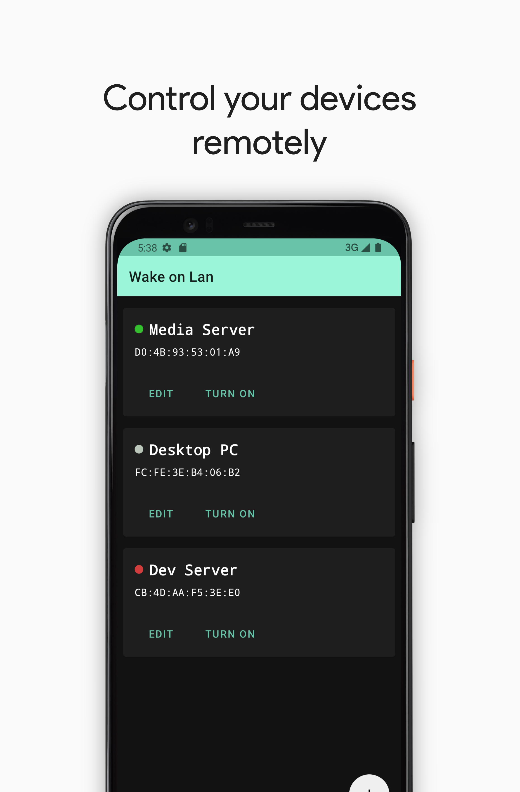
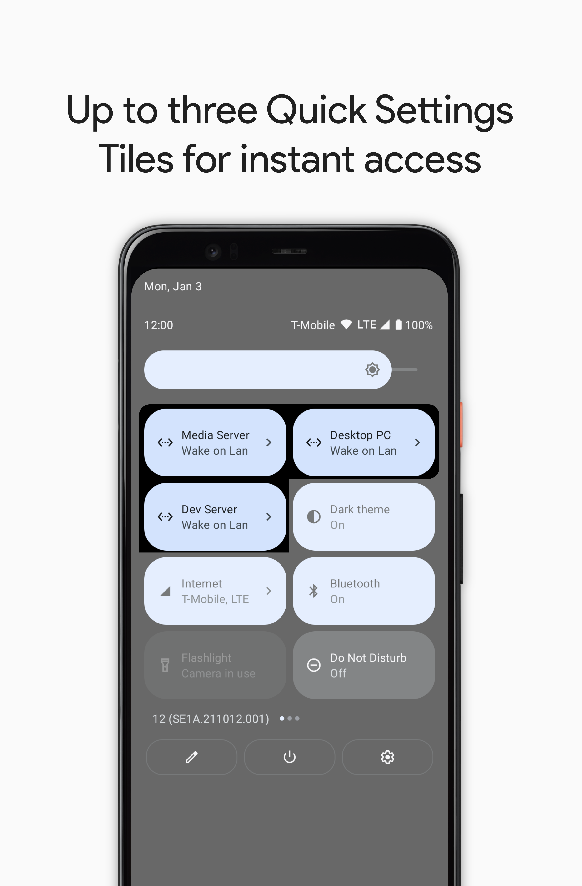
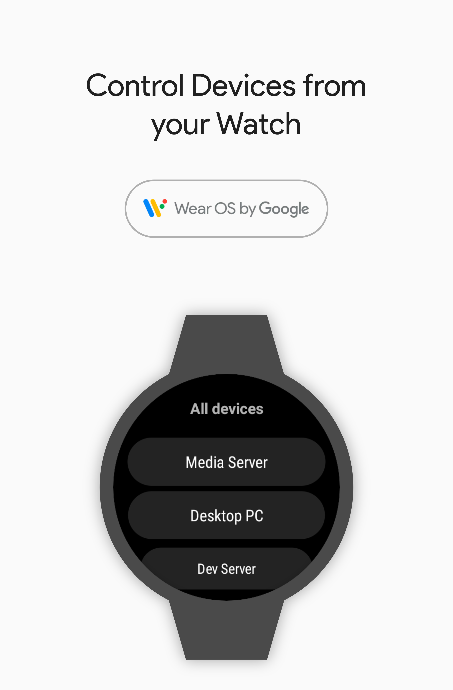
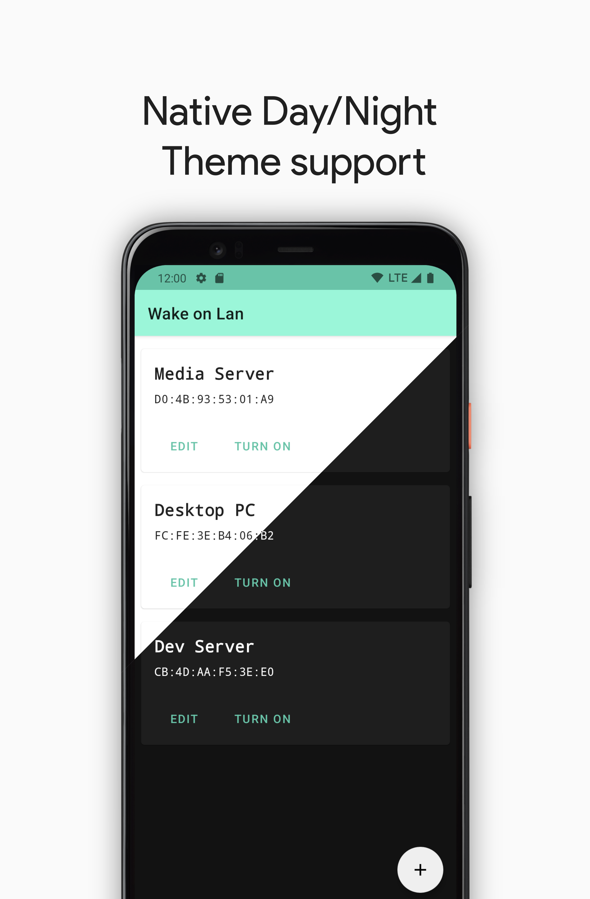
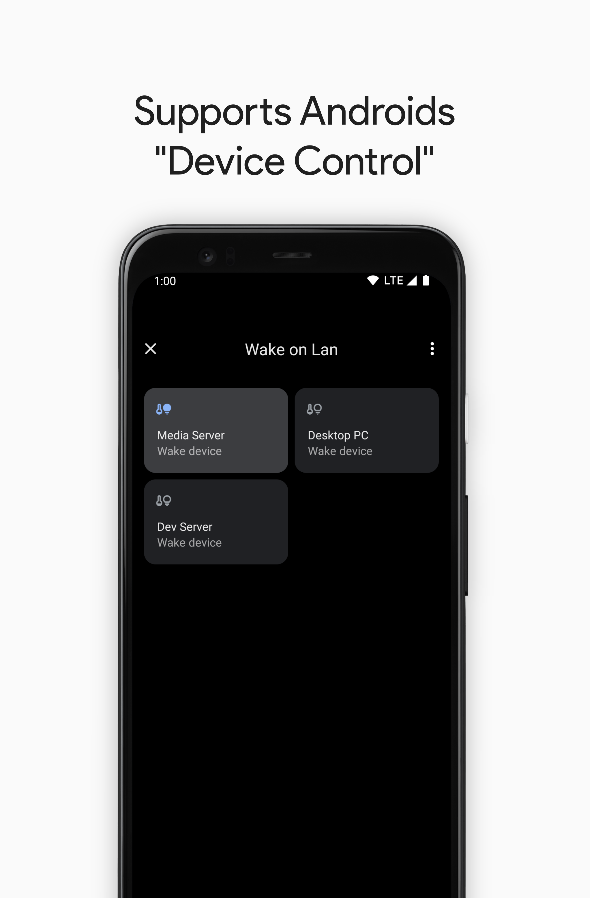

## Wake on Lan

### Description

This app let's you control your devices using Wake on Lan. Multiple devices can be configured in the
app, which can later be controlled either from the app itself or from up to three Quick Settings
Tiles. Each device's online status is displayed in the list overview.

The companion app for Wear OS let's you control your devices directly from the watch.

### Screenshots

<table>
    <tr>
        <td></td>
        <td></td>
    </tr>
    <tr>
        <td></td>
        <td></td>
    </tr> 
    <tr>
        <td></td>
    </tr> 
</table>
