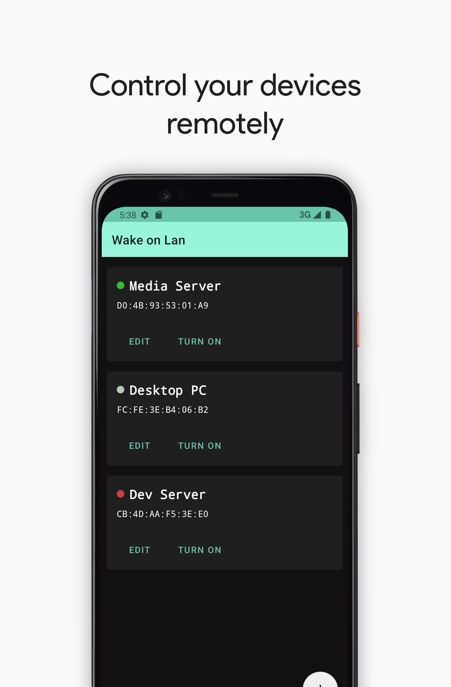
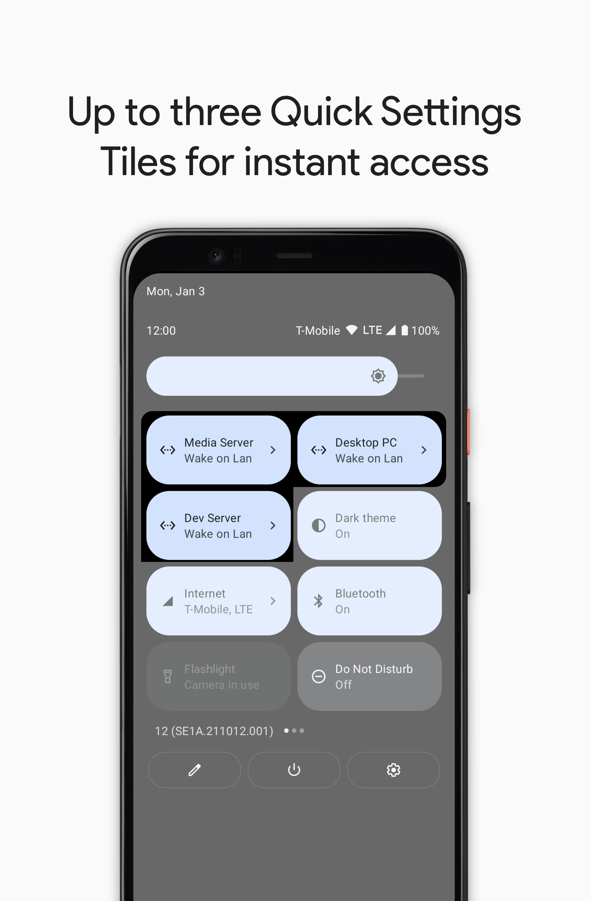
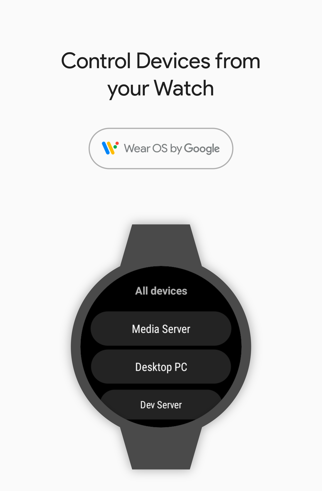
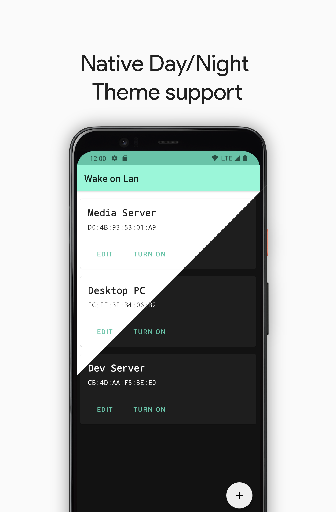
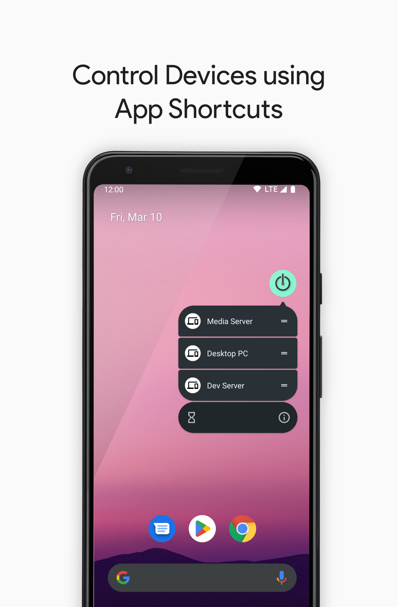
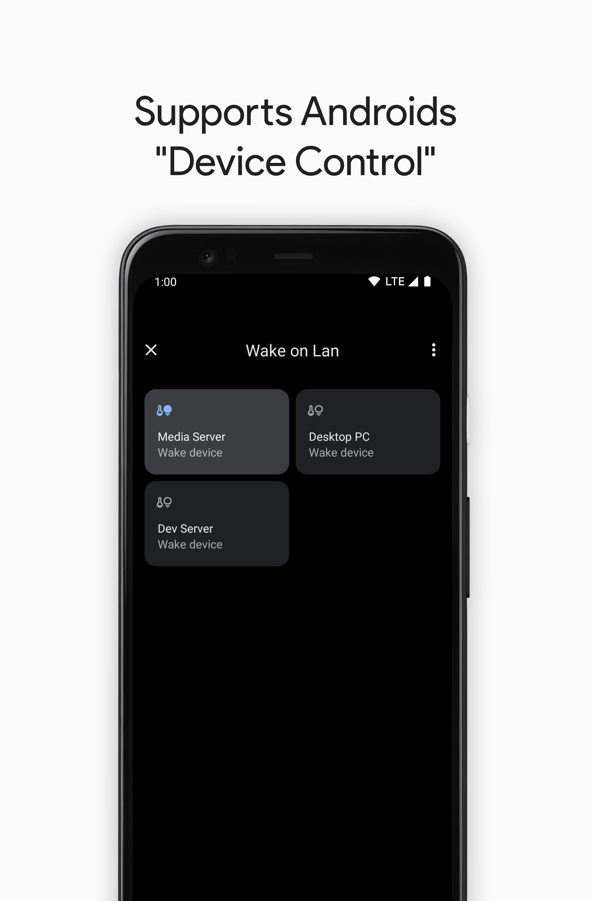

## Wake on Lan

### Description

Wake on Lan lets you power on and manage your devices straight from your phone. Add as many devices
as you like and wake them either from the app or from up to three Quick Settings Tiles for instant
access. The list overview shows each device's online status at a glance, so you always know what's
up and running.

A companion app for Wear OS brings the same control to your wrist, letting you wake your devices
directly from the watch.

### Installation

APKs are published on the [Releases](../../releases) page. Download the latest release and
grab the APK you need:

- `app-release.apk` – the phone/tablet app
- `wear-release.apk` – the Wear OS companion app

#### Mobile (phone / tablet)

1. On your Android device, open the [Releases](../../releases) page and download `app-release.apk`.
2. When prompted, allow installing apps from this source (**Settings → Apps → Special app access →
   Install unknown apps**, then enable it for your browser or file manager).
3. Open the downloaded APK and tap **Install**.
4. Launch **Wake on Lan** and add your devices.

#### Wear OS (watch)

The watch app is distributed separately (it is not bundled with the phone app), so it has to be
installed onto the watch directly via [ADB](https://developer.android.com/tools/adb). Make sure the
phone app is installed first, as devices are configured from the phone and synced to the watch.

1. On the watch, enable developer options: **Settings → System → About → Versions**, then tap
   **Build number** repeatedly until developer mode is enabled.
2. In **Settings → Developer options**, enable **ADB debugging** and **Debug over Wi-Fi** (or
   **Wireless debugging**). Note the IP address and port shown.
3. From a computer with the Android SDK platform-tools installed, connect to the watch:
   ```bash
   adb connect <watch-ip>:<port>
   ```
   Accept the debugging prompt on the watch if it appears.
4. Install the companion app:
   ```bash
   adb -s <watch-ip>:<port> install wear-release.apk
   ```
5. Open **Wake on Lan** on the watch. Your devices configured on the phone will appear
   automatically.

### Screenshots

<table>
    <tr>
        <td></td>
        <td></td>
        <td></td>
    </tr>
    <tr>
        <td></td>
        <td></td>
        <td></td>
    </tr> 
</table>
